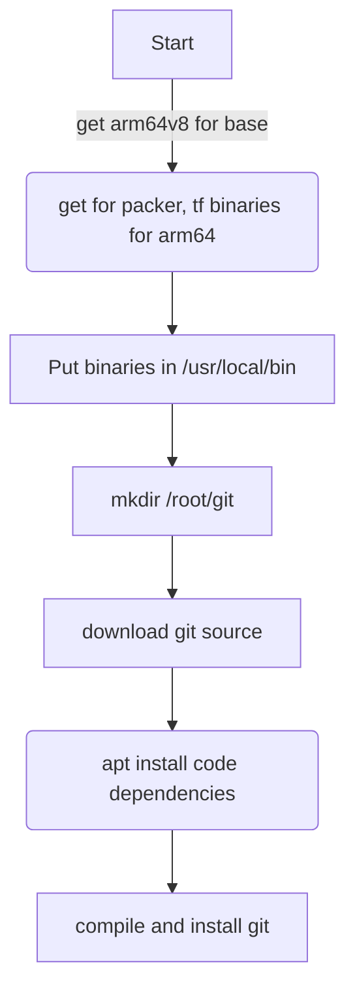

# arm64-packer-tf-container
This is what I am using for an arm64 container with packer,terraform, git 

packer and terraform are binaries, and git gets compiled from source.

```mermaid
flowchart TD
    A[Start] -->|get arm64v8 for base| B(get for packer, tf binaries for arm64)
    B --> C[Put binaries in /usr/local/bin]
    C -->D[mkdir /root/git]
    D -->E[download git source]
    E -->F(apt install code dependencies)
    F -->G[compile and install git]

```
    
